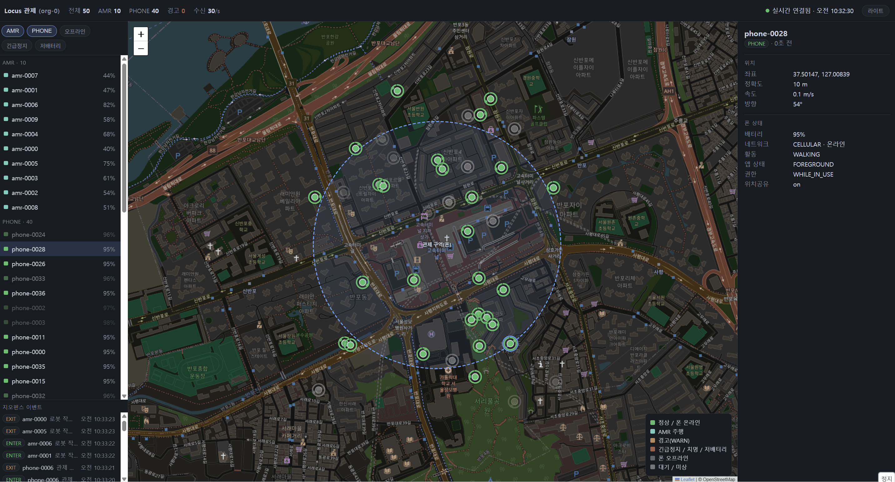
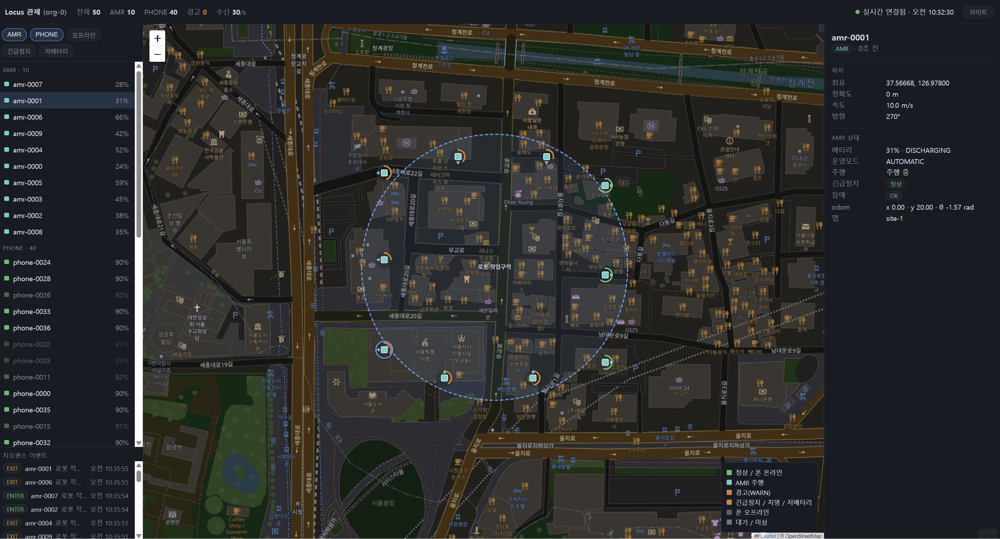
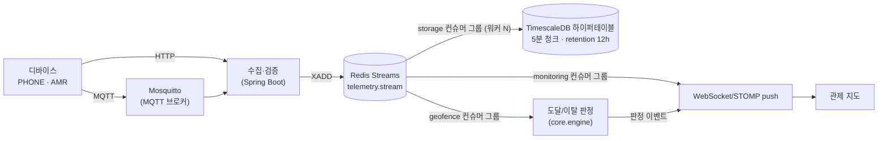

# Locus — 실시간 디바이스 텔레메트리 수집·처리 파이프라인

물리 디바이스(폰·로봇·센서·장비)가 위치·상태를 실시간으로 올리고, 한 명이 다수를 모니터링하는 백본입니다.
디바이스를 추상화해서 폰(`PHONE`)·로봇(`AMR`)은 같은 코어를 공유하는 구체 타입일 뿐이고, 코어는 디바이스 종류를 모릅니다. 새 타입을 더해도 판정 엔진·엔티티는 불변입니다(M3에서 AMR 추가로 검증 — 아래 데모의 로봇이 그 둘째 타입). 어떤 물리 객체든 같은 파이프라인으로 수집·반영합니다.

> IoT·디지털 트윈 맥락의 텔레메트리 백본입니다. 구체 적용 예: 현장학습 인솔 교사가 다수 학생 단말의 위치·상태를 실시간으로 모니터링.

이 프로젝트는 추측이 아니라 측정으로 판단합니다. 가장 단순한 구현에서 시작해 부하로 한계를 재현하고, 병목을 확인하고, 개선 후 재측정합니다. 효과 없던 시도도 기록합니다.

---

## 데모 — 실시간 관제

| 실시간 위치 관제 (폰) | 지오펜스 판정 (로봇 순찰) |
|---|---|
|  |  |

시뮬레이터가 폰·로봇 50대를 섞어 1Hz로 텔레메트리를 흘리고, 웹 지도가 WebSocket으로 실시간 반영합니다. 로봇이 작업구역 경계를 넘나들면 지오펜스 ENTER/EXIT가 판정돼 이벤트로 표시됩니다.

## 핵심 결과

**단일 노후 박스(4코어·8GB·5400rpm HDD)에서, 1만 대 디바이스가 1초에 한 건씩 보내는 텔레메트리를 전 구간(HTTP → Redis Streams → TimescaleDB)에서 60분 이상 유실 없이 처리.** 보낸 쪽(k6 발신 38,616,836건) ≈ 받은 쪽(스트림 수신 38,617,038건) ≈ 저장한 쪽(미확인·포이즌 0)을 정산해 확인했습니다 — [M-e2e-soak](docs/measurements/M-e2e-soak.md).

여기까지의 적재 경로 개선 기록:

| 단계 | 적재 처리량 | 병목 → 개선 |
|---|---|---|
| M0 단건 insert | 33 req/s | 커밋당 HDD fsync (측정으로 확증) |
| M1 배치 적재 | 1,437 req/s (**~44×**) | 요청당 fsync 1.2 → 0.06, 내구성 유지 |
| M2 TimescaleDB 전환 | 5,459 rows/s (~3.8×) | InnoDB 랜덤 쓰기 → 하이퍼테이블 순차 쓰기 |
| M2-par 워커 병렬화 | **10,000 rows/s 무손실** | 단일 배치 워커 → N 워커 그룹 커밋 |
| M-e2e-soak 통합 소크 | 1만 대 × 1Hz, 60분+ 무손실 | 남은 한계 = 부하 생성기 (서버 p95 24ms 여유) |

읽기 경로는 쿼리 재설계(상관 서브쿼리 → `LATERAL`)로 관제 조회 p95 8.65s → 35ms(**~250×**) — [M4a](docs/measurements/M4a.md).

> 절대수치는 이 박스 종속입니다. 결론은 before/after 비율과 병목 귀속입니다.

---

## 아키텍처



- 수집 전송 = HTTP + MQTT(다른 계층, 공존) · fan-out = Redis Streams 컨슈머 그룹 · 저장 = TimescaleDB.
- 컨슈머는 at-least-once(적재 성공 후에만 `XACK`) + 포이즌 내성(손상 엔트리는 드롭·카운트, 워커는 생존).
- 중복은 저장 계층이 멱등 흡수(`ON CONFLICT (device_id, recorded_at)`).

---

## 측정 기록 (시간순)

각 단계는 *문제 상황 → 변경 → 측정 → 해석* 순서의 측정 문서와 원본 데이터를 남깁니다. 요약만 보려면 접힌 제목줄만 읽으면 됩니다.

<details>
<summary><b>M0 — baseline: 단건 insert 33 req/s, 병목 = HDD fsync</b> (2026-06)</summary>

가장 단순한 구현(요청 1건 = 트랜잭션 1개 = 커밋 1번)의 최대 처리량을 쟀습니다. 포화점 ~33 req/s.

병목이 HDD fsync임을 세 지표로 확증: CPU 유휴(2~8%) + HikariCP 커넥션 대기 적체(pending ~190) + 디스크 %util 97%. 계산과도 일치합니다 — fsync 한계 ~40회/s ÷ 요청당 ~1.2회 ≈ 33. 풀·JVM 튜닝은 무효(커넥션을 늘려도 같은 fsync에서 대기)라는 것도 이때 확인했습니다.

상세: [M0.md](docs/measurements/M0.md)
</details>

<details>
<summary><b>M1 — 배치 적재로 33 → 1,437 req/s (~44×), 내구성 유지</b></summary>

fsync를 줄이는 두 축(flush 설정 완화 vs 배치)을 변수 분해(A0~A3)로 측정했습니다.

- `innodb_flush_log_at_trx_commit=2`(내구성 완화): 33 → 66. fsync가 원인임을 격리(진단용).
- 배치 적재(인메모리 큐 + 배치 워커, 멀티로우 INSERT): **1,437 req/s**, 요청당 fsync 1.2 → 0.059, **내구성 유지(flush=1)**.
- 배치 후 flush 완화(A3)는 무변 — redo 로그는 더는 병목이 아님. 내구성을 포기해 얻는 게 없어 배치만 채택.

상세: [M1.md](docs/measurements/M1.md)
</details>

<details>
<summary><b>M2 — TimescaleDB 전환: 랜덤 → 순차 쓰기, 5,459 rows/s (~3.8×)</b></summary>

M1 이후 남은 병목은 data fsync(InnoDB B-tree 제자리 갱신 = 랜덤 쓰기). 시계열 append 워크로드에 맞게 저장소를 TimescaleDB 하이퍼테이블(순차 쓰기)로 교체하고 MySQL을 제거했습니다.

포화점 1,437 → 5,459 rows/s, durable(`synchronous_commit=on`), 디스크 피크 59%(미포화)·평균 쓰기 200KB(순차) — 랜덤→순차 전환을 디스크 지표로 확증. 선택 근거와 기각한 대안(InfluxDB·ClickHouse·QuestDB 등)은 [ADR 0008](docs/decisions/0008-telemetry-store-timescaledb.md).

상세: [M2.md](docs/measurements/M2.md)
</details>

<details>
<summary><b>M2-par·sustain — 워커 병렬화 + 청크 사이징으로 지속 10k 무손실, 압축은 측정으로 기각</b></summary>

- 병목이 단일 배치 워커로 이동 → N 워커 병렬화(그룹 커밋 스케일)로 단일 HDD에서 도착 10k 무손실 달성. 다중 워커 device upsert 데드락도 이때 발견·수정(락 순서 통일).
- 장시간 적재는 DB 성장으로 하락(13k → <10k) → 원인은 현재 청크 인덱스가 shared_buffers 초과. **청크 7일 → 5분**으로 63분 평평(편차 ±1%, 드롭 0).
- **압축 정책은 측정으로 기각**: 압축비는 40×로 좋았으나 과정의 읽기 I/O가 포화 HDD에서 적재를 굶겨 27분간 586만 행 드롭. raw 적재 + **retention 12h**(청크 drop, I/O 쌈)로 확정.

상세: [M2-par.md](docs/measurements/M2-par.md) · [M2-sustain.md](docs/measurements/M2-sustain.md)
</details>

<details>
<summary><b>M4a — 읽기 경로: 쿼리 재설계로 관제 조회 p95 8.65s → 35ms (~250×)</b></summary>

디바이스별 최신 조회(naive 상관 서브쿼리)가 100만 행에서 8.7s. `EXPLAIN`으로 원인 확인 — 결과는 디바이스 수만큼 작은데 일이 전체 행 수에 비례(서브쿼리 100만 회 재실행).

`DISTINCT ON`(전체 정렬, RAM 초과 시 디스크 정렬로 급락)과 `LATERAL`(device당 PK 인덱스 1회 = O(디바이스))을 비교 측정, LATERAL 채택. 캐시 없이 쿼리만으로 ~250×. Redis 캐시 코드는 있으나 쿼리로 충분해 기본 비활성(캐시의 역할은 push 접속 스냅샷으로 보류).

상세: [M4a.md](docs/measurements/M4a.md)
</details>

<details>
<summary><b>M4b — Redis Streams fan-out: 지속 10k 무손실, 재시작 at-least-once, 포이즌 내성</b></summary>

인메모리 큐를 Redis Streams로 교체 — `storage`·`monitoring` 컨슈머 그룹 분리, WebSocket/STOMP push(지도 폴링 대체).

- 지속 10k 무손실(워커 4·MAXLEN 400K — maxmemory에서 역산해 사이징), 재시작 시 pending 회수로 at-least-once 실증.
- 짧은 부하는 warm-up을 정상상태로 오인한다는 것도 이때 기록(90s 런의 "10K 못 버팀"은 트랜지언트, 5분 런으로 정정).
- 포이즌 내성: 트림돼 payload가 없는 pending 엔트리·손상 JSON이 두 컨슈머를 각각 망가뜨리던 버그를 수정(처리 불가 엔트리는 드롭·카운트, 좋은 엔트리만 처리 후 XACK).

상세: [M4b.md](docs/measurements/M4b.md)
</details>

<details>
<summary><b>M-MQTT — IoT 표준 수집 경로: 인입 병렬화로 3.25K → ~9K (2.8×)</b></summary>

MQTT(Mosquitto, `telemetry/{deviceId}`) 수집 추가. 첫 측정에서 ~3.25K — 같은 저장 경로가 HTTP로는 9.7K를 처리하므로 병목을 인입 계층(단일 Paho 콜백 스레드)으로 격리. 워커 스레드 8 + shared subscription 다중 연결로 ~9K까지. "디스크 90% = 저장 한계"가 아니라 저인입의 증상(작은 배치 → 잦은 커밋)이었다는 오판 정정 포함.

상세: [M-MQTT.md](docs/measurements/M-MQTT.md)
</details>

<details>
<summary><b>M3 — 추상화 검증: 둘째 디바이스 타입(AMR) 추가에 core 로직 diff 0</b></summary>

수집 봉투를 디바이스 무관하게 재설계(공통칸 + `metrics` JSONB)하고 최소수집 게이트를 `DeviceTypeHandler.gate()` 전략으로 이동. 로봇 타입 `AMR`을 추가했을 때 core 변경은 enum 값 1줄 + 게이트 훅뿐(판정 엔진·엔티티 불변) — 양축 추상화가 실제로 동작함을 diff로 검증. 폰 프라이버시 게이트(permission=DENIED → 위치 미수집)는 동작 불변을 테스트로 고정.

AMR 상태 스키마는 임의로 지어내지 않고 개방 표준(ROS 2 `common_interfaces` Apache-2.0 · VDA5050 MIT)을 참조해 이 저장소에서 독립 정의했습니다 — Boston Dynamics SDK는 제품 전용 라이선스(BDSDK-SL)라 제외. 로봇 고유 상태(`operatingMode`·`estopState`·`batteryStatus`·odom 등)는 `metrics` JSONB에 문자열 코드로 담아 core는 여전히 디바이스 타입을 모르고(상태 어휘는 `app`에만), `AmrHandler`가 물리적 모순(주행 중인데 비상정지·점검·충전)을 거부합니다.

상세: 구조 검증이라 별도 측정 문서 없음 — 근거는 ArchUnit 경계 테스트·core diff([STATUS](docs/STATUS.md) M3 절), AMR 스키마 설계 근거는 [amr-telemetry.md](docs/reference/amr-telemetry.md).
</details>

<details>
<summary><b>M-http-capacity — HTTP 인입 최대 처리량의 병목 = 박스 CPU (12K → 16K 선형 확장)</b></summary>

fresh 볼륨 함대 스윕(1 VU = 1 디바이스 1Hz)으로 인입 상한 규명. 코어 핀 6 → 8에 12K → 16K 선형 확장 = CPU가 병목(지배분은 앱 요청 처리 ≈0.3ms/req, DB 아님). 이전 측정의 "HTTP ~10K 한계" 귀속을 정정(누적 DB 상태 열화 + 부하도구 포화 구간의 값이었음).

상세: [M-http-capacity.md](docs/measurements/M-http-capacity.md)
</details>

<details>
<summary><b>M-e2e-soak — 전 구간 통합 소크: 60분+ 무손실, 지속 한계는 부하 생성기</b> (2026-07)</summary>

그동안 구간별로 따로 검증했던 것을 전 구간(HTTP → Streams → TimescaleDB)으로 한 번에: 1만 대 × 1Hz, 66분, **유실 0**(양끝 정산 — k6 발신 ≈ 스트림 수신 ≈ 전량 적재, lag·pending·포이즌 0).

- 지속 처리량이 10k를 살짝 못 미친(~9.8k) 원인을 규명: 서버는 정상(p95 24ms·디스크 70%)인데 부하 머신이 포화(load 11.47 > 코어 10·메모리 고갈) — **한계는 파이프라인이 아니라 단일 부하 생성기**.
- 가상 스레드 실험은 회귀로 기각(처리량 ↓·지연 25×) — 무제한 admission이 공유 직렬화 지점을 과부하시켰고, 바운드 스레드풀이 사실상의 admission control이었음. 오판·정정 과정 포함 기록.

상세: [M-e2e-soak.md](docs/measurements/M-e2e-soak.md)
</details>

---

## 아키텍처 결정

결정의 이유와 기각한 대안을 [ADR](docs/decisions/)에 남깁니다. 코드보다 "왜"를 먼저 보면 좋습니다.

- **측정 주도** — 단순한 정답부터(YAGNI), 부하·프로파일링으로 병목을 찾고, 측정 근거로만 개선. 효과 없던 시도(압축·bgwriter 트리클·가상 스레드)도 기록.
- **저장소: MySQL → TimescaleDB 전환 완료** — M1에서 병목이 InnoDB B-tree 랜덤 쓰기임을 측정, 시계열 적재에 맞는 순차 쓰기(하이퍼테이블) + 보존 자동화(retention)로 교체. [ADR 0008](docs/decisions/0008-telemetry-store-timescaledb.md)
- **메시징: Redis Streams (Kafka 아님)** — fan-out·결합도 분리는 컨슈머 그룹으로 충분하고 이 규모에 가볍습니다. 최대 처리량은 메시지 큐가 아니라 저장소가 정한다는 것을 측정으로 확인. 한계 도달 시 측정 결과를 보고 Kafka 전환 검토. [ADR 0007](docs/decisions/0007-messaging-storage-redis-streams-and-governance.md)
- **DeviceType이 데이터 거버넌스 축** — 디바이스 타입이 보존 정책과 데이터 도달 범위를 가릅니다(폰 위치는 장기 보존 경로가 구조상 없음). [ADR 0007](docs/decisions/0007-messaging-storage-redis-streams-and-governance.md)
- **포트는 교체 지점에만** — 헥사고날 전면 채택 없이, 구현을 교체할 계획이 있는 이음새(수집·캐시·지오펜스 상태)에만 출력 포트. [ADR 0004](docs/decisions/0004-ports-only-at-improvement-seams.md)
- **core는 infra-free + ArchUnit** — 도메인·전략·판정 엔진은 Spring·Kafka·Redis·Web에 의존하지 못합니다(빌드 게이트로 강제). [ADR 0002](docs/decisions/0002-single-module-with-archunit.md) · [ADR 0003](docs/decisions/0003-feature-slice-with-core-app-split.md)
- **열린 위험은 등록부로** — 결정(ADR)·보류(ROADMAP)와 구분해, 알고 있는 미해결 위험(Redis 장애 시 버퍼 유실, 지속 과부하 시 조용한 트림 등)을 [RISKS.md](docs/RISKS.md)에 유지.

---

## 기술 스택

- **현재**: Java 21 · Spring Boot 3.4 · Gradle(Kotlin DSL) · TimescaleDB(PostgreSQL 16) · Redis 7(Streams) · Mosquitto(MQTT) · WebSocket/STOMP · k6 · Prometheus/Grafana · Docker · ArchUnit · Flyway
- **로드맵**: 위치 암호화·보존 정책(M6) · 시간 파티셔닝 조회·복제(M7) · Kubernetes(M8)

---

## 빠른 시작

```bash
# 0) (선택) 로컬 환경변수 — 기본값으로도 동작
cp .env.example .env

# 1) 인프라 기동 (TimescaleDB + Redis + Mosquitto + node-exporter)
docker compose up -d

# 2) 앱 실행 (호스트 JVM에서 직접 — M8 전까지)
./gradlew bootRun
#    프로덕션 인입 경로(Redis Streams)로 실행하려면:
#    SPRING_PROFILES_ACTIVE=stream ./gradlew bootRun

# 3) 시뮬레이터로 가상 디바이스 전송 (폰 + AMR 혼합)
./gradlew bootRun --args='--spring.profiles.active=simulator'

# 4) 단위 + 웹 테스트 (빠름, Docker 불필요)
./gradlew test

# 5) 통합 테스트 (Testcontainers 실 PostgreSQL·Redis, Docker 필요)
./gradlew check
```

- 앱: http://localhost:8093 · 메트릭: http://localhost:8093/actuator/prometheus
- 관제 지도: http://localhost:8093 (Leaflet, WebSocket push — 타입별 마커·상태·지오펜스 이벤트)

<details>
<summary>통합 테스트 로컬 실행 시 colima 설정</summary>

Testcontainers가 colima 소켓·새 Docker API를 인식하도록 아래 env가 필요합니다(빌드가 테스트 JVM에 전달). CI(GitHub Actions 표준 Docker)는 불필요합니다.

```bash
export DOCKER_HOST="unix://$HOME/.colima/default/docker.sock"
export DOCKER_API_VERSION=1.44
export TESTCONTAINERS_DOCKER_SOCKET_OVERRIDE=/var/run/docker.sock
```
</details>

---

## 문서

- [docs/STATUS.md](docs/STATUS.md) — 진행 현황(기준 문서)
- [docs/measurements/](docs/measurements/) — 마일스톤별 측정 기록(원본 로그 포함)
- [docs/decisions/](docs/decisions/) — ADR(왜 + 기각한 대안)
- [docs/RISKS.md](docs/RISKS.md) — 아키텍처 리스크 등록부(열린 위험)
- [docs/STRUCTURE.md](docs/STRUCTURE.md) — 파일트리 ↔ 결정 매핑
- [docs/ROADMAP.md](docs/ROADMAP.md) — 마일스톤 ↔ 트리 위치 + 목표 SLO
- [SECURITY.md](SECURITY.md) — 보안 정책(민감정보·비밀 관리)

---

## 로드맵

- ✅ **M0~M2** 수집·조회·시뮬레이터 + 적재 경로 개선(33 → 1,437 → 지속 10k 무손실)
- ✅ **M4** 실시간 — 읽기 경로 ~250× · Redis Streams fan-out · WebSocket push (잔여: 인증)
- ✅ **M-MQTT** IoT 표준 수집 경로 (3.25K → ~9K)
- ✅ **M3** 추상화 검증 — 타입 추가에 core diff 0
- ✅ **M-e2e-soak** 전 구간 통합 소크 60분+ 무손실
- 🔄 **M5** 지오펜스 판정 엔진(`core.engine` — 슬라이스1 구현, 검증 중)
- ⬜ **M6** 민감정보 보호·보존 · **M7** 대용량 조회·복제 · **M8** 컨테이너·k8s · (페이즈2) 명령 다운링크·정합성

> 목표 SLO와 전체 마일스톤은 [ROADMAP](docs/ROADMAP.md)에 있습니다. 측정 근거 없이 기능을 늘리지 않고, 각 단계를 before/after로 정당화합니다.
