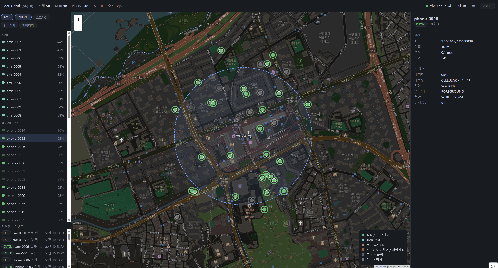
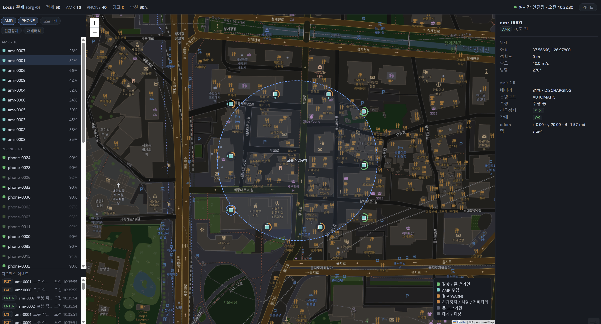
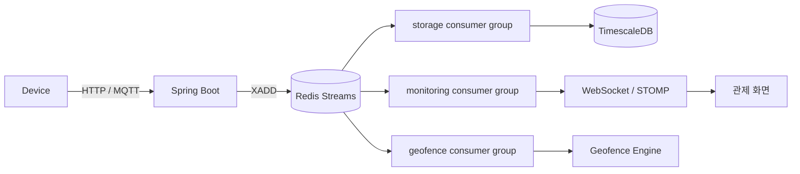
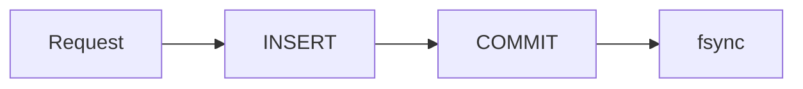
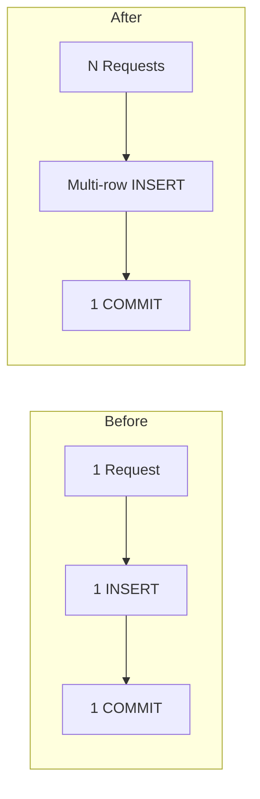
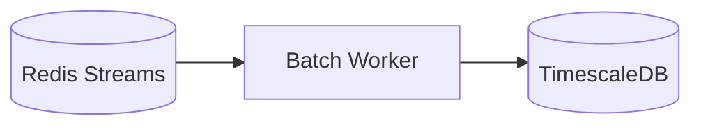
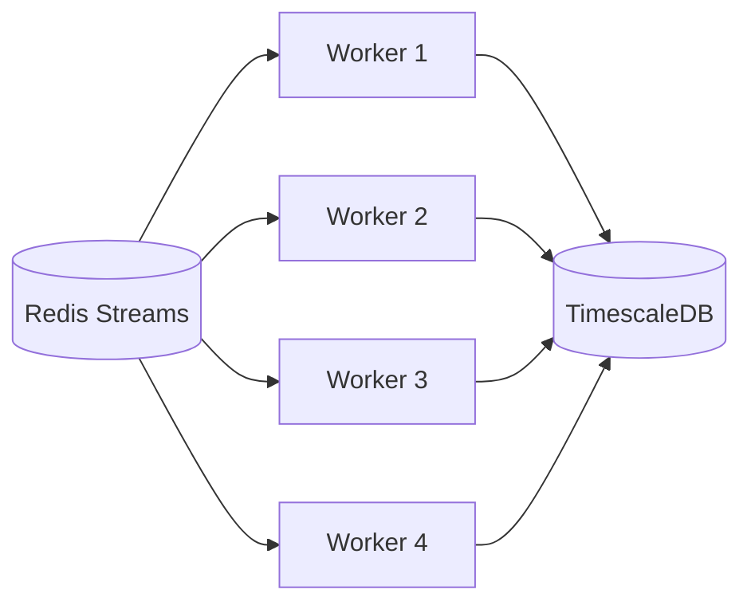
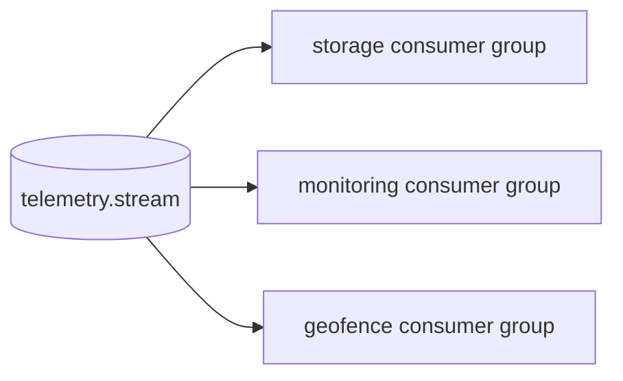
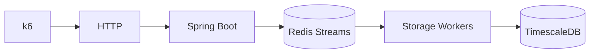

# Locus : 실시간 디바이스 텔레메트리 수집·처리 파이프라인

폰, 로봇, 센서처럼 지속적으로 상태를 보내는 디바이스의 텔레메트리를 수집하고 저장하는 프로젝트입니다.

HTTP와 MQTT로 데이터를 받고 Redis Streams를 거쳐 TimescaleDB에 저장합니다. 저장된 위치와 상태는 WebSocket을 통해 관제 화면에 전달하며, 지오펜스 진입/이탈도 실시간으로 판정합니다.

처음에는 단건 저장으로 구현한 뒤 부하를 걸어 병목을 하나씩 확인했습니다. 배치 적재, 저장소 변경, 워커 병렬화, 쿼리 변경 등을 적용하면서 처리량과 지연이 어떻게 달라지는지 측정했습니다.

---

## 데모 - 실시간 관제

| 실시간 위치 관제 (폰) | 지오펜스 판정 (로봇 순찰) |
|---|---|
|  |  |

시뮬레이터가 폰과 로봇 50대를 섞어 1Hz로 텔레메트리를 전송합니다. 웹 지도에는 위치가 WebSocket으로 실시간 반영되며, 로봇이 작업구역 경계를 통과하면 지오펜스 ENTER/EXIT 이벤트가 표시됩니다.

---

## 핵심 결과

**단일 머신(4코어·8GB·5400rpm HDD)에서 1만 대 디바이스가 1초에 한 건씩 보내는 텔레메트리를 HTTP → Redis Streams → TimescaleDB 전체 구간에서 60분 이상 유실 없이 처리했습니다.**

k6 발신량 38,616,836건, Redis Streams 수신량 38,617,038건, 미확인·포이즌 메시지 0건을 함께 확인했습니다.

상세: [M-e2e-soak](docs/measurements/M-e2e-soak.md)

### 적재 경로 개선

| 단계 | 적재 처리량 | 변경 내용 |
|---|---:|---|
| M0 단건 INSERT | 33 req/s | 요청마다 INSERT와 COMMIT 수행 |
| M1 배치 적재 | 1,437 req/s | 여러 요청을 모아 다중 행 INSERT |
| M2 TimescaleDB 전환 | 5,459 rows/s | 시계열 적재에 맞게 저장소 변경 |
| M2-par 워커 병렬화 | 10,000 rows/s | 단일 배치 워커를 여러 워커로 분리 |
| M-e2e-soak 통합 테스트 | 1만 대 × 1Hz, 60분+ | 전체 파이프라인 장시간 테스트 |

읽기 경로는 디바이스별 최신 상태 조회 쿼리를 상관 서브쿼리에서 `LATERAL` 방식으로 변경해 p95를 8.65초에서 35ms로 줄였습니다.

상세: [M4a](docs/measurements/M4a.md)

> 절대 처리량은 테스트 머신의 하드웨어와 설정에 영향을 받습니다. 각 단계에서는 같은 환경에서 변경 전후를 비교했습니다.

---

## 처리 흐름


```mermaid
flowchart LR
    DEV["Device"]
    APP["Spring Boot"]
    RS[("Redis Streams")]

    STORAGE["storage consumer group"]
    MONITORING["monitoring consumer group"]
    GEOFENCE["geofence consumer group"]

    DB[("TimescaleDB")]
    WS["WebSocket / STOMP"]
    MAP["관제 화면"]
    GF["Geofence Engine"]

    DEV -->|"HTTP / MQTT"| APP
    APP -->|XADD| RS

    RS --> STORAGE --> DB
    RS --> MONITORING --> WS --> MAP
    RS --> GEOFENCE --> GF
```

| 구간 | 처리 내용 |
|---|---|
| 수집 | HTTP와 MQTT로 들어온 텔레메트리를 Spring Boot에서 같은 처리 경로로 받아 Redis Streams에 적재합니다. |
| 저장 | `storage` Consumer Group이 메시지를 읽어 TimescaleDB에 저장합니다. 저장 완료 후에만 `XACK`합니다. |
| 중복 처리 | 같은 메시지가 다시 처리될 수 있으므로 `(device_id, recorded_at)` UNIQUE 제약조건과 `ON CONFLICT`로 중복 저장을 막습니다. |
| 실시간 관제 | `monitoring` Consumer Group이 메시지를 읽어 WebSocket/STOMP로 관제 화면에 전달합니다. |
| 지오펜스 | `geofence` Consumer Group이 위치를 읽어 ENTER/EXIT를 판정합니다. |

---

## 측정 기록

각 단계의 상세 조건과 원본 로그는 [`docs/measurements`](docs/measurements/)에 정리했습니다.

---

<details>
<summary><b>M0 - 단건 INSERT 33 req/s</b></summary>

<br>

### 시작 구조

처음에는 요청 한 건마다 INSERT와 COMMIT을 수행했습니다.


```mermaid
flowchart LR
    R["Request"]
    I["INSERT"]
    C["COMMIT"]
    F["fsync"]

    R --> I --> C --> F
```

### 측정

처리량은 약 33 req/s에서 더 이상 증가하지 않았습니다.

당시 상태는 다음과 같았습니다.

- CPU 사용률: 2~8%
- HikariCP pending: 약 190
- 디스크 `%util`: 약 97%
- 요청당 fsync: 약 1.2회

커넥션 풀 크기와 JVM 설정을 바꿔도 처리량은 거의 달라지지 않았습니다.

### 확인한 내용

요청마다 발생하는 디스크 동기화가 처리량을 제한하고 있었습니다.

상세: [M0.md](docs/measurements/M0.md)

<br>

</details>

---

<details>
<summary><b>M1 - 배치 적재 33 → 1,437 req/s</b></summary>

<br>

### 변경

fsync 횟수를 줄이기 위해 flush 설정 변경과 배치 적재를 각각 테스트했습니다.

#### flush 설정 변경

```text
innodb_flush_log_at_trx_commit=1
→
innodb_flush_log_at_trx_commit=2
```

처리량은 33 req/s에서 약 66 req/s로 증가했습니다.

디스크 동기화 비용이 처리량에 영향을 주고 있다는 것을 확인하기 위한 테스트였고, 내구성 조건이 달라지기 때문에 최종 설정에는 적용하지 않았습니다.

#### 배치 적재


```mermaid
flowchart LR
    subgraph BEFORE["Before"]
        R1["1 Request"]
        I1["1 INSERT"]
        C1["1 COMMIT"]

        R1 --> I1 --> C1
    end

    subgraph AFTER["After"]
        RN["N Requests"]
        BI["Multi-row INSERT"]
        BC["1 COMMIT"]

        RN --> BI --> BC
    end
```

### 결과

```text
33 req/s
→
1,437 req/s
```

요청당 fsync 횟수도 약 1.2회에서 0.059회로 감소했습니다.

배치 적재 이후에는 flush 설정을 추가로 완화해도 처리량 차이가 거의 없어 기존 내구성 설정을 유지했습니다.

상세: [M1.md](docs/measurements/M1.md)

<br>

</details>

---

<details>
<summary><b>M2 - TimescaleDB 전환 1,437 → 5,459 rows/s</b></summary>

<br>

### 문제

배치 적재 이후에도 디스크 I/O가 처리량을 제한했습니다.

Locus의 텔레메트리는 기존 값을 반복해서 수정하는 데이터보다 시간 순서대로 계속 추가되는 데이터에 가깝습니다.

```text
device A - 10:00:01
device B - 10:00:01
device A - 10:00:02
device B - 10:00:02
...
```

### 변경

MySQL에서 PostgreSQL 기반 TimescaleDB로 저장소를 변경하고 하이퍼테이블을 사용했습니다.

InfluxDB, ClickHouse, QuestDB도 함께 비교했습니다.

선택 과정: [ADR 0008](docs/decisions/0008-telemetry-store-timescaledb.md)

### 결과

```text
1,437 rows/s
→
5,459 rows/s
```

`synchronous_commit=on` 상태에서 측정했으며 디스크 피크 사용률은 약 59%였습니다.

상세: [M2.md](docs/measurements/M2.md)

<br>

</details>

---

<details>
<summary><b>M2-par - 저장 워커 병렬화</b></summary>

<br>

### 문제

TimescaleDB 전환 이후에는 단일 배치 워커가 다음 병목이 됐습니다.


```mermaid
flowchart LR
    RS[("Redis Streams")]
    BW["Batch Worker"]
    DB[("TimescaleDB")]

    RS --> BW --> DB
```

### 변경

배치 워커를 여러 개로 나눠 동시에 저장하도록 변경했습니다.


```mermaid
flowchart LR
    RS[("Redis Streams")]
    W1["Worker 1"]
    W2["Worker 2"]
    W3["Worker 3"]
    W4["Worker 4"]
    DB[("TimescaleDB")]

    RS --> W1
    RS --> W2
    RS --> W3
    RS --> W4

    W1 --> DB
    W2 --> DB
    W3 --> DB
    W4 --> DB
```

### 추가로 발생한 문제

여러 워커가 같은 device 레코드를 갱신하면서 데드락이 발생했습니다.

업데이트 대상의 락 획득 순서를 통일해 해결했습니다.

### 결과

초당 10,000건까지 지속적으로 저장할 수 있었습니다.

상세: [M2-par.md](docs/measurements/M2-par.md)

<br>

</details>

---

<details>
<summary><b>M2-sustain - 장시간 적재와 하이퍼테이블 청크 조정</b></summary>

<br>

### 문제

짧은 테스트에서는 10,000건/s 이상을 처리했지만 데이터가 계속 쌓이면 처리량이 감소했습니다.

현재 청크의 인덱스 크기가 `shared_buffers`를 넘어가는 시점부터 성능이 떨어졌습니다.

### 변경

하이퍼테이블 청크 구간을 다음과 같이 변경했습니다.

```text
7일
→
5분
```

### 결과

변경 후 63분 동안 약 ±1% 범위에서 초당 10,000건의 처리량을 유지했습니다.

### 압축 테스트

TimescaleDB 압축도 함께 테스트했습니다.

저장 공간은 크게 줄었지만 압축 과정에서 발생하는 읽기 I/O가 HDD를 사용하면서 실시간 적재가 밀렸습니다.

현재 테스트 환경에서는 압축을 사용하지 않고 12시간 retention 이후 청크를 삭제하도록 구성했습니다.

상세: [M2-sustain.md](docs/measurements/M2-sustain.md)

<br>

</details>

---

<details>
<summary><b>M4a - 최신 상태 조회 p95 8.65s → 35ms</b></summary>

<br>

### 문제

관제 화면에서는 전체 텔레메트리가 아니라 각 디바이스의 가장 최근 상태 한 건이 필요합니다.

처음 사용한 상관 서브쿼리는 데이터가 100만 건까지 증가했을 때 p95 약 8.65초가 걸렸습니다.

### 비교

`EXPLAIN` 실행 계획을 확인하고 다음 두 방법을 비교했습니다.

- `DISTINCT ON`
- `LATERAL`

`DISTINCT ON`은 많은 데이터를 정렬해야 했고 메모리를 초과하면 디스크 정렬이 발생했습니다.

`LATERAL`은 각 디바이스에 대해 인덱스를 이용해 최신 데이터 한 건만 조회할 수 있었습니다.

### 결과

```text
p95 8.65s
→
35ms
```

Redis 캐시를 추가하지 않은 상태의 결과입니다.

현재는 DB 조회만으로 필요한 응답 시간을 확보해 기본 조회 경로에서는 캐시를 사용하지 않습니다.

상세: [M4a.md](docs/measurements/M4a.md)

<br>

</details>

---

<details>
<summary><b>M4b - Redis Streams fan-out과 재처리</b></summary>

<br>

### 변경


```mermaid
flowchart LR
    RS[("telemetry.stream")]

    STORAGE["storage consumer group"]
    MONITORING["monitoring consumer group"]
    GEOFENCE["geofence consumer group"]

    RS --> STORAGE
    RS --> MONITORING
    RS --> GEOFENCE
```

각 Consumer Group은 같은 이벤트를 독립적으로 처리합니다.

### 재시작 처리

메시지를 처리한 뒤에만 `XACK`하도록 구성했습니다.

처리 중 애플리케이션이 종료되면 해당 메시지는 Pending 상태로 남고, 재시작 후 다시 가져와 처리합니다.

### 처리할 수 없는 메시지

테스트 중 다음 데이터가 워커를 중단시키는 문제도 있었습니다.

- Stream trim으로 payload가 사라진 Pending Entry
- 파싱할 수 없는 JSON

처리할 수 없는 메시지는 별도로 집계하고 건너뛰도록 변경해 다른 정상 메시지는 계속 처리하도록 했습니다.

상세: [M4b.md](docs/measurements/M4b.md)

<br>

</details>

---

<details>
<summary><b>M-MQTT - MQTT 수집 3.25K → 약 9K</b></summary>

<br>

### 추가한 경로

IoT 디바이스에서 많이 사용하는 MQTT(Message Queuing Telemetry Transport) 수집 경로를 추가했습니다.

```text
telemetry/{deviceId}
```

### 문제

첫 측정에서는 약 3,250건/s에서 처리량이 더 이상 증가하지 않았습니다.

같은 저장 경로를 사용하는 HTTP에서는 약 9,700건/s를 처리하고 있었기 때문에 MQTT 수집 구간을 확인했습니다.

### 원인

Paho MQTT 클라이언트의 단일 callback 처리 구간에서 병목이 발생했습니다.

### 변경

- 작업 처리 스레드 8개
- Shared Subscription
- 다중 MQTT 연결

### 결과

```text
3,250 msg/s
→
약 9,000 msg/s
```

상세: [M-MQTT.md](docs/measurements/M-MQTT.md)

<br>

</details>

---

<details>
<summary><b>M3 - AMR 디바이스 타입 추가</b></summary>

<br>

처음에는 PHONE 텔레메트리만 처리했지만 이후 AMR(Autonomous Mobile Robot)을 추가했습니다.

### 데이터 구조

공통 데이터는 고정 필드로 두고 디바이스별 상태는 `metrics` JSONB에 저장합니다.

```text
Telemetry
├── deviceId
├── deviceType
├── recordedAt
├── location
└── metrics
```

### 타입별 처리

타입별 수집 조건은 `DeviceTypeHandler`에서 처리합니다.

```text
PHONE → PhoneHandler
AMR   → AmrHandler
```

AMR 타입을 추가할 때 지오펜스 판정 엔진과 텔레메트리 엔티티는 변경하지 않았습니다.

AMR 상태 값은 ROS 2 `common_interfaces`와 VDA5050을 참고해 정의했습니다.

상세:

- [STATUS.md](docs/STATUS.md)
- [amr-telemetry.md](docs/reference/amr-telemetry.md)

<br>

</details>

---

<details>
<summary><b>M-http-capacity - HTTP 인입 처리량 12K → 16K</b></summary>

<br>

HTTP 수집 구간 자체의 최대 처리량도 별도로 측정했습니다.

동일한 데이터베이스 상태에서 애플리케이션에 할당한 CPU 코어 수만 변경했습니다.

```text
6 cores → 약 12K req/s
8 cores → 약 16K req/s
```

코어 수를 늘렸을 때 처리량도 함께 증가했습니다.

해당 조건에서는 애플리케이션의 요청 처리 CPU가 병목이었습니다.

상세: [M-http-capacity.md](docs/measurements/M-http-capacity.md)

<br>

</details>

---

<details>
<summary><b>M-e2e-soak - 전체 구간 60분 이상 장시간 테스트</b></summary>

<br>

각 구간을 따로 측정한 뒤 마지막으로 전체 경로를 연결해 장시간 테스트했습니다.


```mermaid
flowchart LR
    K6["k6"]
    HTTP["HTTP"]
    APP["Spring Boot"]
    RS[("Redis Streams")]
    SW["Storage Workers"]
    DB[("TimescaleDB")]

    K6 --> HTTP --> APP --> RS --> SW --> DB
```

### 조건

```text
10,000 devices
1 event / device / second
66 minutes
```

### 결과

발신량, Redis Streams 수신량, 저장 상태를 비교했고 테스트 종료 시 처리되지 않고 남은 메시지는 없었습니다.

서버 HTTP p95는 약 24ms였고 디스크 사용률에도 여유가 있었습니다.

테스트 후반 실제 생성량이 약 9.8K/s에 머문 구간에서는 k6를 실행한 부하 생성 머신의 CPU와 메모리가 포화된 상태였습니다.

### 가상 스레드 테스트

Java Virtual Thread도 같은 조건에서 테스트했습니다.

해당 구조에서는 처리량이 감소하고 지연이 증가해 기존 bounded thread pool 구성을 유지했습니다.

상세: [M-e2e-soak.md](docs/measurements/M-e2e-soak.md)

<br>

</details>

---

## 아키텍처 결정

주요 기술 선택과 비교 내용은 [ADR](docs/decisions/)에 정리했습니다.

### 저장소: MySQL → TimescaleDB

배치 적재 이후에도 디스크 쓰기가 처리량을 제한해 시계열 적재에 맞는 저장소를 비교했습니다.

현재 설정:

```text
chunk interval: 5 minutes
retention: 12 hours
compression: disabled
```

[ADR 0008](docs/decisions/0008-telemetry-store-timescaledb.md)

---

### 메시징: Redis Streams

저장, 관제, 지오펜스 처리를 독립적으로 소비하기 위해 Redis Streams Consumer Group을 사용합니다.

현재 필요한 기능은 다음과 같습니다.

- Consumer Group
- Pending 메시지 재처리
- 처리 완료 후 ACK
- 처리 경로별 fan-out

현재 규모에서는 Redis Streams로 필요한 구조를 구성할 수 있어 Kafka는 사용하지 않았습니다.

[ADR 0007](docs/decisions/0007-messaging-storage-redis-streams-and-governance.md)

---

### DeviceType

PHONE과 AMR은 같은 텔레메트리 구조를 사용하지만 타입마다 필요한 상태 값과 수집 조건은 다릅니다.

타입별 차이는 `DeviceTypeHandler`에서 처리하고 공통 처리 로직은 유지했습니다.

[ADR 0007](docs/decisions/0007-messaging-storage-redis-streams-and-governance.md)

---

### 포트 적용 범위

프로젝트 전체를 헥사고날 구조로 구성하지 않고 구현을 교체할 가능성이 있는 경계에만 포트를 사용했습니다.

현재 적용 영역:

- 수집
- 캐시
- 지오펜스 상태

[ADR 0004](docs/decisions/0004-ports-only-at-improvement-seams.md)

---

### core 의존성

지오펜스 판정과 디바이스별 정책을 포함하는 `core` 패키지는 Spring, Redis, Web 계층에 직접 의존하지 않도록 구성했습니다.

ArchUnit 테스트에서 의존 방향을 확인합니다.

- [ADR 0002](docs/decisions/0002-single-module-with-archunit.md)
- [ADR 0003](docs/decisions/0003-feature-slice-with-core-app-split.md)

---

### 리스크 관리

현재 알고 있는 미해결 항목은 [RISKS.md](docs/RISKS.md)에 따로 정리합니다.

예:

- Redis 장애 시 인입 데이터 처리
- 지속적인 과부하에서 Stream trim이 발생하는 경우
- 관제 인증

---

## 기술 스택

- Java 21
- Spring Boot 3.4
- Gradle Kotlin DSL
- PostgreSQL 16 / TimescaleDB
- Redis 7 / Redis Streams
- Mosquitto / MQTT
- WebSocket / STOMP
- Flyway
- Prometheus / Grafana
- k6
- Docker
- Testcontainers
- ArchUnit

---

## 빠른 시작

Docker Compose로 전체 환경을 실행할 수 있습니다.

```bash
docker compose --profile app up -d
```

다음 구성요소가 함께 실행됩니다.

- TimescaleDB
- Redis
- Mosquitto
- Spring Boot 애플리케이션
- 디바이스 시뮬레이터

실행 후 다음 주소에서 관제 화면을 확인할 수 있습니다.

```text
http://localhost:8093
```

시뮬레이터는 PHONE 40대와 AMR 10대의 텔레메트리를 1초마다 전송합니다.

```bash
docker compose --profile app logs -f app
docker compose --profile app down -v
```

메트릭:

```text
http://localhost:8093/actuator/prometheus
```

---

<details>
<summary><b>포트 또는 CPU 설정 변경</b></summary>

<br>

기본 포트를 이미 사용 중이라면 `.env` 파일에서 변경할 수 있습니다.

```bash
cp .env.example .env
```

설정 가능한 포트:

```text
DB_HOST_PORT
REDIS_HOST_PORT
MQTT_HOST_PORT
APP_HOST_PORT
```

기본 CPU pinning은 `0-5`입니다.

macOS와 Windows에서는 Docker VM에 할당된 vCPU가 6개 미만이면 실행되지 않을 수 있습니다.

Colima:

```bash
colima stop
colima start --cpu 8 --memory 8
```

Docker Desktop에서는 `Settings → Resources`에서 CPU 수를 변경할 수 있습니다.

CPU pinning 없이 실행하려면 `.env`에 다음 값을 설정합니다.

```text
LOCUS_CPUSET=
```

이 경우 README에 기록한 성능 측정 조건과는 달라집니다.

<br>

</details>

---

<details>
<summary><b>호스트 JVM으로 실행</b></summary>

<br>

README에 기록한 성능 측정은 호스트 JVM에서 진행했습니다.

측정 환경과 실행 조건은 [RUNBOOK](docs/measurements/RUNBOOK.md)에 정리했습니다.

인프라만 Docker로 실행합니다.

```bash
docker compose up -d
```

기본 실행:

```bash
./gradlew bootRun
```

Redis Streams 경로:

```bash
SPRING_PROFILES_ACTIVE=stream ./gradlew bootRun
```

시뮬레이터:

```bash
./gradlew bootRun --args='--spring.profiles.active=simulator'
```

테스트:

```bash
./gradlew test
./gradlew check
```

<br>

</details>

---

<details>
<summary><b>통합 테스트 로컬 실행 시 Colima 설정</b></summary>

<br>

Testcontainers에서 Colima Docker 소켓을 사용하려면 다음 환경 변수를 설정합니다.

```bash
export DOCKER_HOST="unix://$HOME/.colima/default/docker.sock"
export DOCKER_API_VERSION=1.44
export TESTCONTAINERS_DOCKER_SOCKET_OVERRIDE=/var/run/docker.sock
```

GitHub Actions의 기본 Docker 환경에서는 별도 설정이 필요하지 않습니다.

<br>

</details>

---

## 문서

- [docs/STATUS.md](docs/STATUS.md) - 진행 현황
- [docs/measurements/](docs/measurements/) - 성능 측정 기록과 원본 로그
- [docs/decisions/](docs/decisions/) - 주요 기술 선택과 비교 내용
- [docs/RISKS.md](docs/RISKS.md) - 현재 확인된 리스크
- [docs/STRUCTURE.md](docs/STRUCTURE.md) - 프로젝트 구조
- [docs/ROADMAP.md](docs/ROADMAP.md) - 이후 작업
- [SECURITY.md](SECURITY.md) - 보안 관련 설정
