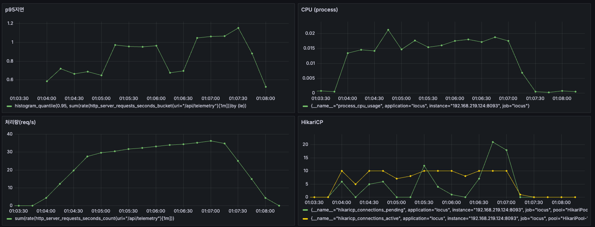
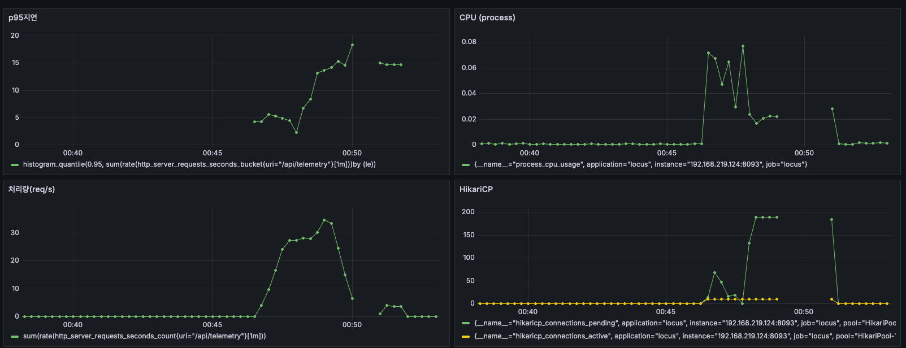

# M0 — 기준선 (baseline)

> M0의 목표는 "개선"이 아니라 **정확한 기준점 확보**다. 이후 모든 마일스톤이 이 수치와 비교된다.

## 요약

**결론: 최대 처리량(maximum throughput) ≈ 33 req/s이고, 병목(bottleneck)은 HDD의 fsync다.**

| 무엇 | 결과 | 근거 |
|---|---|---|
| **최대 처리량** | **≈ 33 req/s** | 열린(포화점 ~33)·닫힌(중앙값 36.5) 모델 + 아래 계산이 모두 일치 |
| **병목** | **HDD fsync** | ① CPU 유휴(2~8%) ② HikariCP 적체(pending 190) ③ 디스크 %util 97% |
| **왜 33인가** | 계산으로 설명됨 | fsync 25ms → 디스크 한계 ~40 fsync/s, 요청당 ~1.2 fsync → 40÷1.2 ≈ 33 |
| **다음(M1)** | 배치 적재 | 요청당 fsync를 N건당 1회로 줄여 최대 처리량을 높인다 |

- **읽는 법**: 처리량(33)이 시스템의 한계값이고, p95 응답시간은 한계 초과·정착 상태에 따라 변동하므로 단독으로 보면 안 된다(아래 "측정 신뢰성").
- **의미**: CPU·커넥션 풀은 한가한데 디스크 fsync 하나가 전체를 제한한다 → 풀·JVM 튜닝은 효과 없고, fsync 횟수를 줄여야 한다(M1).

---

## 핵심 결과

### ① 최대 처리량 ≈ 33 req/s

**닫힌 모델 baseline** (`telemetry-baseline.js`, 50 VU 2분, 3회 중앙값, 2026-06-29)
| 런 | 처리량 (req/s) | p95 (s) |
|---|---|---|
| 1 | 36.3 | 1.70 |
| 2 | 36.5 | 1.63 |
| 3 | 38.0 | 1.60 |
| **중앙값** | **36.5** | **1.63** |
> 에러율 0%·검증 거부율 0%(전부 202).

**열린 모델 capacity** (`telemetry-capacity.js`): **포화점(saturation point) ≈ 33 1Hz 디바이스.** 도착률을 올려도 달성 처리량은 ~33에서 더 오르지 않음(상세는 아래 측정 신뢰성).

> **닫힌 36.5 > 열린 33** — 닫힌 50VU는 50개가 동시에 커밋해 **group commit**이 fsync를 일부 묶으므로 처리량이 약간 높다. 둘 다 fsync가 병목(33~38 범위). group commit은 M1에서 다룰 방법 중 하나.

### ② 병목 = HDD fsync

**박스 `iostat -xzt 1 sda`** (런 D, 194 정착샘플 평균)
| 지표 | 값 | 의미 |
|---|---|---|
| `%util` | **96.8%** (max 118*) | 디스크 포화 (*>100은 보고 한계) |
| `f/s` (fsync/초) | **39.0** (max 52) | fsync 처리 속도 ≈ 한계 |
| `f_await` (fsync 대기) | **25.3 ms** | HDD 회전지연. 최대 처리량의 근본 원인 |
| `w/s` / `w_await` | 87.6 / 17.6 ms | 쓰기 |
| `aqu-sz` | 2.62 | I/O 큐 적체 |

**맥 Grafana** (서버측, 모든 런 공통)
| 지표 | 값 | 의미 |
|---|---|---|
| `process_cpu_usage` | 최대 **0.02 ~ 0.08** | CPU 거의 유휴 → **CPU가 병목 아님** |
| HikariCP `pending`/`active` | 포화 ~190/~10 · 정착 ~0~20/~10 | 풀(기본10) 한계, 잉여 요청은 DB 쓰기 대기 |

**최대 처리량 계산**
```
f_await ≈ 25ms        →  fsync는 직렬 처리, 한계 ≈ 1000/25 ≈ 40 fsync/s
실측 f/s ≈ 39          (디스크가 fsync로 포화, %util 97)
달성 처리량 ≈ 33 req/s  →  요청당 fsync ≈ 39/33 ≈ 1.2
→ 최대 처리량 ≈ 40 ÷ 1.2 ≈ 33   ← 모든 런의 달성 처리량과 일치
```
요청당 ~1.2 = InnoDB redo flush + 트랜잭션 내 Device upsert UPDATE 등. 최대 처리량이 계산으로 설명된다.

**스크린샷**
- 정착 런(p95<1s): 
- 포화 런(포화점 초과): 

---

## 측정 환경

**2-머신 구성** (전체 절차는 [RUNBOOK.md](RUNBOOK.md))

| | 박스 (측정 대상) | 맥북 (부하·관측) |
|---|---|---|
| 역할 | Locus 앱 + MySQL | k6(부하) + Prometheus/Grafana |
| 하드웨어 | i7-6700HQ 4c/8t · RAM 8GB · **5400rpm HDD** | — |
| OS | Ubuntu 22.04 | macOS |
| 연결 | ← 유선 LAN, **RTT avg 0.81ms** (min 0.56 / max 0.95) → | |

**박스 상세 설정**

| 항목 | 값 |
|---|---|
| JVM | Temurin 21.0.11 · 힙 -Xms1500m -Xmx1500m · G1 · `taskset -c 0-5` |
| DB | MySQL 8.0.40 (docker, 포트 3307, buffer_pool 2G, cpuset 0-5, mem_limit 3G) |
| 자원 격리 | Locus = 박스 ≈3/4 (코어 0–5, ~6G). 시스템 MySQL(idle)+OS에 1/4(코어 6–7, ~2G) 예약 |
| 측정 시작 행수 | 34,987 (앞선 capacity 런 누적 — 빈 DB 아님) |

> **절대수치는 이 HDD 환경에 종속** → 비율(before/after)로 해석. 측정 내내 시스템 MySQL(포트 3306) idle·고정, `free -h` Swap=0 유지.
> Grafana p95 PromQL: `histogram_quantile(0.95, sum(rate(http_server_requests_seconds_bucket{uri="/api/telemetry"}[1m])) by (le))`

---

## 측정 신뢰성 (과정)
> 결론이 아니라 그 근거. capacity는 4회 런으로 측정 오염을 제거하고 최대 처리량을 확정한 과정이다.

| 런 | RATES | 달성 처리량 | p95 | dropped | 비고 |
|---|---|---|---|---|---|
| A | 20…70 | 평탄 ~33 | 30.8s | 1138 | 포화점 한참 초과 |
| B | 28…38 | 30/s | 8.36s | 205 | A 직후(미정착) |
| C | 28…38 | 31.4/s | **0.96s** | 0 | 정착(평균이 한계 아래) |
| D | 33…39 | 33.18/s | 6.74s | 119 | 한계 초과 주행 + iostat 캡처 |

- **달성 처리량은 모든 런에서 ~33으로 일정** (닫힌 baseline 32.9 1회차 포함). 이 값이 최대 처리량.
- **p95는 최대 처리량이 아니라 백로그에 따른 값**: 도착률을 한계(~33) 위로 얼마나 올리느냐와 정착 상태에 따라 0.96s~30s로 변동. 런 C가 낮았던 건 평균 도착률(31)이 한계 아래였기 때문이지 포화점이 높아서가 아니다.
- **측정 위생**: 초기 런(A·B)은 미정착·이전 백로그 잔류로 p95가 부풀려졌다. "3회·정착·램프 버림"이 필요한 이유.
- 정정 기록: 한때 ~36으로 봤으나 런 C의 낮은 평균을 잘못 읽은 것. 4런+iostat로 ~33 확정.

---

## 해석 & 다음 (M1)
- **병목 = HDD fsync**: CPU 유휴 + HikariCP 적체 + 디스크 %util 97%·f_await 25ms·f/s 39, 세 증거가 같은 결론.
- **풀 튜닝은 효과 없음**: 포화 런에서 pending 190인데 active는 10에서 안 늘어난다. 커넥션을 늘려도 동일한 fsync에서 대기할 뿐이고, CPU가 유휴이므로 풀은 병목이 아니다. (M1에서 풀 사이즈 스윕으로 확인 예정.)
- **M1에서 줄일 것**: 요청당 fsync(~1.2)를 **배치로 N건당 1회**로 낮춘다. 핵심 지표 = `f/s`(또는 `Innodb_data_fsyncs`)/req. Device upsert는 교란변수라 분리 측정(M1 A2-x). → [M1.md](M1.md).

---

## 부록
**M0 구현 선택 (단순 우선)** — 조기 최적화 금지. 측정으로 필요성이 확인되는 마일스톤에서 개선.
- 단건 insert (벌크는 M2) · offset 페이징 (커서는 M7) · 새로고침 조회 (실시간 푸시는 M4).

**원본 측정 데이터** — 가공 전 원본은 [`M0-raw/`](M0-raw/)에 보관(재현·검증용).
- `M0-raw/iostat-runD.log` — 런 D iostat 전체(1999줄). 위 평균값(%util 96.8·f/s 39 등)의 산출 근거.
- `M0-raw/k6-output.txt` — capacity 4런 + baseline 3런 k6 출력.

**남은 보강 (결론 불변, 형식·정밀화)**
- 정착 런 3회 중앙값으로 포화점 확정 · 닫힌 baseline 추가 반복.
