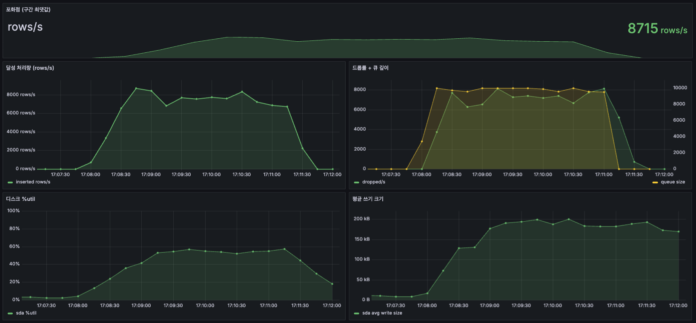
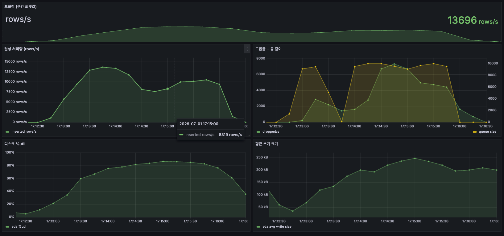
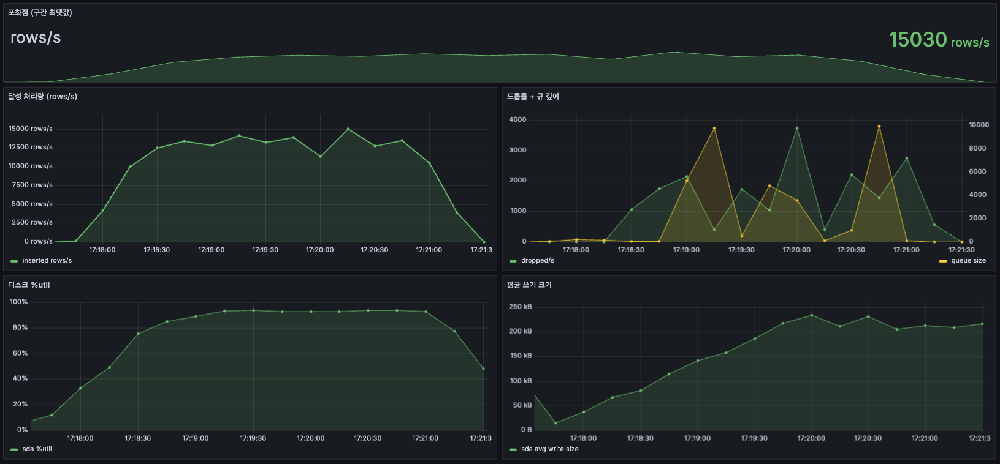
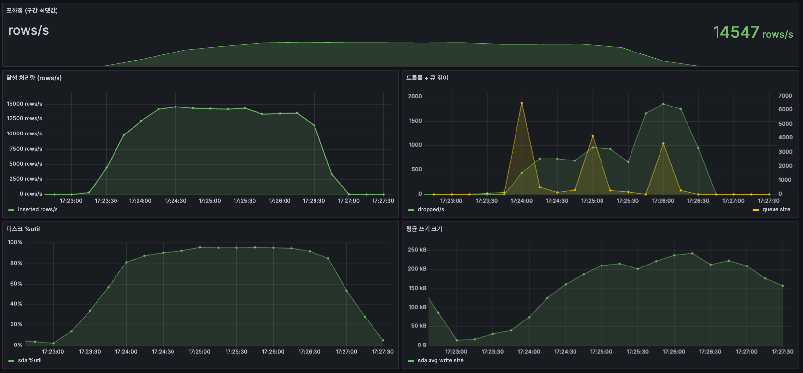
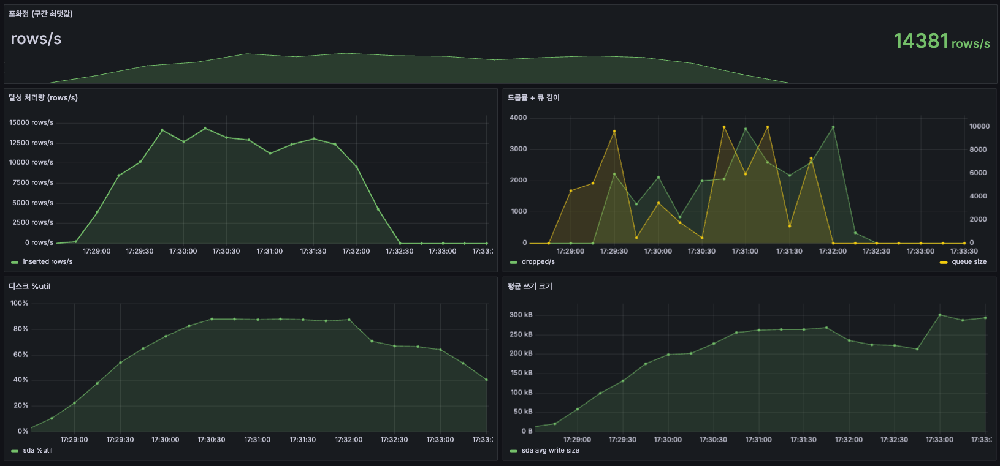
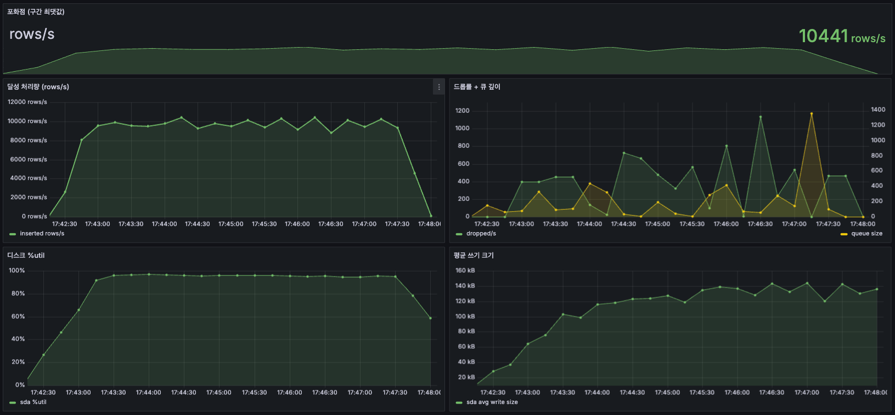
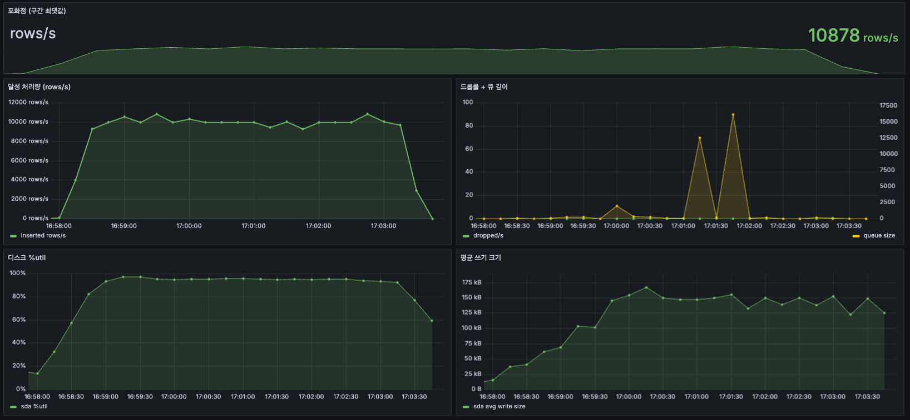
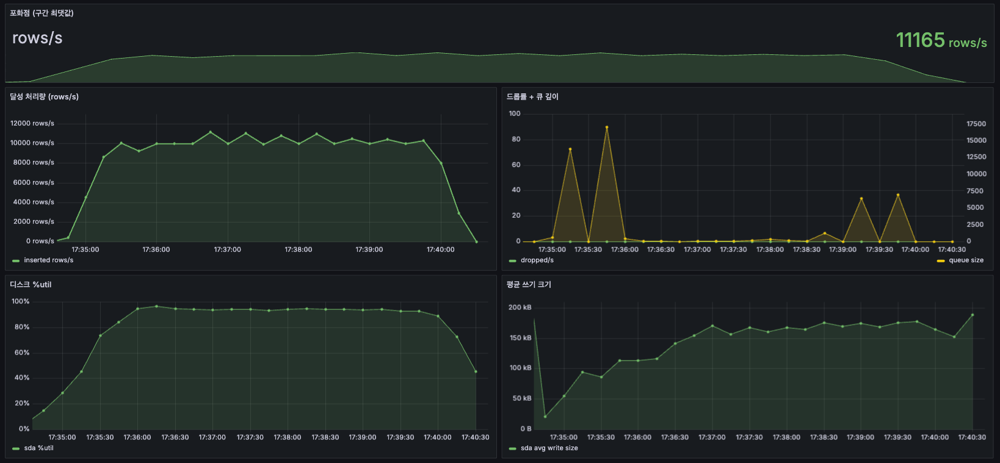

# M2-par — 워커 병렬화와 적재 무손실 용량 (단일 HDD 10k)

> 상태: **측정 완료(2026-07-01, 통제 재측정)**. 트리거: [M2.md](M2.md). 후속 과제: M4 Redis 최신상태 캐시.
> 측정: DB 리셋 후 **런마다 truncate**, `checkpoint_timeout=1min`(스톨을 잘게 쪼개 단일 런 안정화), 토글은 워커 N=4 고정. 캡처는 각 단계, 명령어는 접이식.

## 목표
도착 **10,000 rows/s(SLO)** 텔레메트리를 **무손실(드롭 0)** 로 적재한다.

## 문제 상황
병목이 단일 배치 워커로 이동했다. M2 종료 시점 포화점 5,459인데 디스크 사용률은 59%다. 단일 워커가 직렬 처리해 디스크 여유를 못 쓴다. 확인할 것: ① 워커를 N개로 늘리면 SLO에 도달하는가, ② 병목은 어디로 이동하는가, ③ 10k를 무손실로 적재할 수 있는가.

## 해결 과정 (요약)
1. **워커 병렬화로 디스크 포화까지 스케일** — N=1 7,686 → N=8 13,452, 디스크 51% → 93%. 디스크 순차 쓰기 대역폭이 한계.
2. **device upsert는 ~5% 페널티** — device 갱신을 켜도 12,935 → 12,282. device 행 락은 부차적이다.
3. **드롭의 원인은 큐 용량** — 체크포인트 스톨 backlog(~16k)를 큐가 담으면 무손실. 큐 10k는 드롭, 큐 ≥16k는 드롭 0.
4. **10k SLO는 device 켠 채로 무손실 달성** — device 갱신 + 큐 200k에서 도착 10k 드롭 0.

## 해결 과정 (상세)

### 1. 워커 병렬화 — 디스크 포화까지 스케일
워커를 늘리면 디스크가 찰 때까지 처리량이 오른다. device 갱신을 끈(append-only) 상태로 도착률 15,000 과포화, 워커 수별 지속 처리량:

| 워커 N | 적재(지속) | 디스크 %util |
|---|---|---|
| 1 | 7,686 rows/s | 51% |
| 2 | 10,754 rows/s | 78% |
| 4 | 12,935 rows/s | 91% |
| 8 | 13,452 rows/s | 93% |

여러 워커가 동시에 커밋하면 디스크 저장(fsync)이 한 번에 묶여 처리량이 오른다(그룹 커밋). 디스크 사용률이 51% → 93%로 차오르며 체감한다(N=4→8은 +517). 디스크 순차 쓰기 대역폭이 한계다. 워커를 8까지 늘려도 하락은 없다.

<details><summary>측정 명령어 (N=1/2/4/8)</summary>

```bash
# 박스: 런마다 truncate 후 WORKERS만 1→2→4→8 (append-off, 큐 10000, 풀 20)
psql -c "TRUNCATE telemetry, device;"
INGEST_MODE=queue INGEST_WORKERS=8 INGEST_DEVICE_UPSERT=false \
  INGEST_QUEUE_CAPACITY=10000 DB_POOL_MAX=20 scripts/run-app.sh
# 맥:
k6 run -e BASE_URL=http://192.168.219.124:8093 -e RATES=15000 -e HOLD=3m -e DEVICES=2000 load/telemetry-capacity.js
```
</details>

| N=1 (7,686 · 51%) | N=2 (10,754 · 78%) |
|---|---|
|  |  |
| **N=4 (12,935 · 91%)** | **N=8 (13,452 · 93%)** |
|  |  |

### 2. device upsert는 ~5% 페널티
device 갱신을 켜도 처리량은 거의 안 떨어진다. N=4 고정, device 갱신만 켜고 끈다(device 갱신 = 텔레메트리와 함께 device 행의 `last_seen`·`status`를 upsert):

| 경로 (N=4) | 적재(지속) | 디스크 %util |
|---|---|---|
| device 갱신 끔 | 12,935 | 91% |
| device 갱신 켬 | 12,282 | 81% |

페널티는 ~5%다. 디스크 사용률이 81%로 살짝 내려가는 건 워커가 핫 device 행 락에 잠깐씩 걸린다는 신호지만(device 풀 2,000행 경합), 처리량 영향은 작다. 깨끗한 DB에서 device upsert는 싸다.

<details><summary>측정 명령어 (N=4 device 갱신 켬)</summary>

```bash
# 박스: 1단계 N=4와 device만 다름 (truncate 후, INGEST_DEVICE_UPSERT=true)
psql -c "TRUNCATE telemetry, device;"
INGEST_MODE=queue INGEST_WORKERS=4 INGEST_DEVICE_UPSERT=true \
  INGEST_QUEUE_CAPACITY=10000 DB_POOL_MAX=20 scripts/run-app.sh
# 맥: RATES=15000, HOLD=3m
```
</details>



**데드락(부수 발견·수정).** 다중 워커 device upsert가 데드락을 일으켰다. 여러 워커가 device 행을 도착 순서대로 잠그면서 교착이 생긴다(A는 B가 잠근 행을, B는 A가 잠근 행을 대기). `deadlock detected`로 배치가 폐기된다. 모든 워커가 device_id 오름차순으로 잠그도록 바꾸면(`TreeMap` 정렬) 교착이 없어진다. → `TelemetryBatchDao.upsertDevices`.

### 3. 드롭의 원인 = 큐 용량
드롭은 큐가 체크포인트 스톨 backlog를 못 담을 때 난다. N=4·append-only·도착 10,000 고정, 큐 크기만 변경:

| 큐 크기 | 드롭(dropped/s) | 큐 최대깊이 |
|---|---|---|
| 10,000 | 485 | 10,000 (상한) |
| 200,000 | **0** | 16,226 (흡수) |

PostgreSQL이 더티 페이지를 주기적으로 디스크에 기록할 때(랜덤 쓰기) I/O가 정체되고, 그 사이 큐 처리 속도가 도착률 밑으로 떨어져 행이 적체된다. backlog는 ~16k까지 쌓인다. 큐 10,000은 이를 못 담아 드롭하고, 큐 200,000은 담아 드롭 0이 된다. 큐 크기는 (최대 정체 시간 × 초당 도착률) × 1.5~2배로 산정한다. backlog가 ~16k이므로 ~32k면 충분하고 200k는 여유다.

<details><summary>측정 명령어 (큐 10k → 200k 토글)</summary>

```bash
# 박스: append-off·N=4, truncate 후 INGEST_QUEUE_CAPACITY만 10000 → 200000
psql -c "TRUNCATE telemetry, device;"
INGEST_MODE=queue INGEST_WORKERS=4 INGEST_DEVICE_UPSERT=false \
  INGEST_QUEUE_CAPACITY=200000 DB_POOL_MAX=20 scripts/run-app.sh
# 맥: SLO 도착률 고정
k6 run -e BASE_URL=http://192.168.219.124:8093 -e RATES=10000 -e HOLD=5m -e DEVICES=2000 load/telemetry-capacity.js
```
</details>

| 큐 10k — 드롭 (큐 상한 도달) | 큐 200k — 무손실 (backlog 흡수) |
|---|---|
|  |  |

### 4. 10k는 device 켠 채로 무손실 달성
device 갱신을 켜도 10k 무손실이 된다. N=4·device 갱신 켬·큐 200k·도착 10,000:

| 적재(지속) | 드롭 | 큐 최대깊이 | 디스크 |
|---|---|---|---|
| 10,169 | **0** | 17,076 | 93% |

device 갱신 켬의 drain(12,282)이 도착 10k보다 높으므로 큐가 backlog(~17k)만 담고 무손실이다. **10k SLO 적재에 device 분리는 필요 없다.** device upsert 페널티(~5%)를 감안해도 여유가 있다.

<details><summary>측정 명령어 (N=4 device 갱신 켬 + 큐 200k @ 10k)</summary>

```bash
# 박스: 3단계 큐 200k에 device만 켬 (truncate 후)
psql -c "TRUNCATE telemetry, device;"
INGEST_MODE=queue INGEST_WORKERS=4 INGEST_DEVICE_UPSERT=true \
  INGEST_QUEUE_CAPACITY=200000 DB_POOL_MAX=20 scripts/run-app.sh
# 맥: RATES=10000, HOLD=5m
```
</details>



## 성과와 다음 단계
**성과**
- 워커 병렬화로 단일 워커 5,459 → 디스크 포화까지 ~13,500(N=8). 디스크 순차 쓰기 대역폭이 한계.
- **단일 5400rpm HDD에서 도착 10,000 rows/s를 device 켠 채로 무손실 적재**(SSD 없이, durable). SLO 달성.
- 드롭 원인을 큐 용량으로 규명. 큐는 backlog(~16k)만 담으면 된다.

**다음 단계 (M4)**
- M4 Redis 최신상태 캐시의 근거는 **적재 처리량이 아니라 실시간 조회**다. 1만 대 device의 최신 위치를 지도에 뿌리는 읽기 경로용이다.
- 인메모리 큐는 프로세스 종료 시 유실된다. Redis Streams 내구 버퍼로 대체해 크래시 생존을 더한다.
- 이 측정에서 드러난 실제 위협은 **시간에 따른 DB 성장**이다(아래 폐기/교정). retention·압축(TimescaleDB 내장)으로 대비한다.

## 측정 환경·지표
| 항목 | 값 |
|---|---|
| SUT(박스) | i7-6700HQ 4c/8t · 8GB · 5400rpm HDD |
| 격리 | `taskset -c 0-5` · `-Xmx1500m` |
| DB | TimescaleDB 2.17.2-pg16 (durable). 스키마는 [M2.md](M2.md)와 동일 |
| 베이스라인 | **런마다 `TRUNCATE telemetry, device`** + `checkpoint_timeout=1min` |
| 부하 | 맥 → 박스, k6 `load/telemetry-capacity.js` |
| 제어 변수 | `INGEST_WORKERS` · `INGEST_DEVICE_UPSERT` · `INGEST_QUEUE_CAPACITY` (한 번에 하나만, 토글은 N=4 고정) |

| 지표 | 정의 | 판정 |
|---|---|---|
| 처리량 | 초당 적재 행수 (`inserted/s`) | 지속 평균값 — 램프·peak Stat 제외 |
| 드롭 | 큐 초과로 폐기된 행 (`dropped/s`, 카운터) | 카운터로 판정 |
| 디스크 | 사용률·평균 쓰기 크기 | 디스크 병목 여부 |

## 폐기한 시도와 교정한 가설
- **DB 성장 미통제 → 세 결론이 부풀려졌다(가장 큰 교정)**: 처음엔 리셋 1회만 하고 런마다 truncate를 안 했다. 세션 내내 telemetry가 수천만 행으로 커지자 insert가 느려져(drain 13k → <10k) 뒤 런들이 오염됐다. 이 때문에 **(a) "N=8 과병렬화"**(실제로는 N=8이 더 높음), **(b) "device 락 −40%"**(실제 −5%), **(c) "10k엔 device 분리 필수"**(실제 device 켠 채 10k 무손실) 세 결론이 모두 잘못 나왔다. 런마다 truncate로 재측정해 바로잡았다. 진짜 위협은 device 락이 아니라 시간에 따른 DB 성장이다.
- **peak Stat으로 포화점을 잘못 읽었다**: 구간 최댓값은 스톨 후 큐가 backlog를 몰아 비울 때 튀는 순간값이라 지속 처리량을 과대평가한다. 지속 평균값으로 교정.
- **단일 3분 런이 ±40% 흔들렸다**: `checkpoint_timeout` 기본 5분이라 3분 런이 체크포인트를 0번 또는 1번 맞아 값이 갈렸다. 1분으로 낮춰(모든 런 고정) 매 런이 체크포인트를 여러 번 포함하게 해 안정화했다. 앞서 폐기한 15분(스톨을 관측 밖으로 숨김)의 정반대 방향이다.
- **bgwriter 공격적 설정은 악화였다**(`bgwriter_lru_maxpages 100→1000`, `bgwriter_delay 200→50ms`): 이미 포화된 단일 디스크에 랜덤 쓰기를 더해 순차 쓰기와 헤드를 경합시켰다. 배치 처리 시간이 3.5ms→199ms로 악화. 포화된 단일 디스크에선 설정으로 정체를 줄이기 어렵고 큐로 흡수하는 편이 유효했다.
