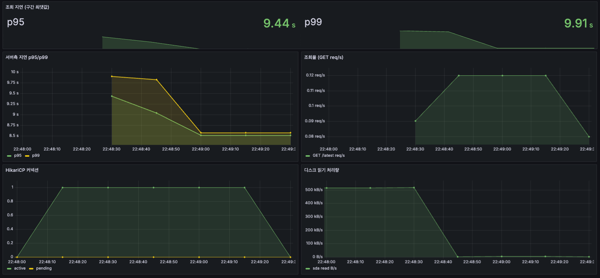
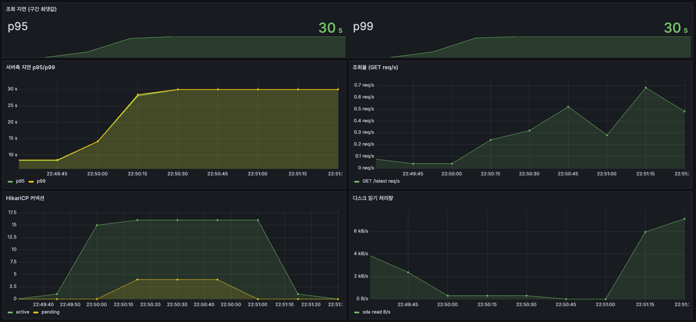

# M4a — 최신상태 조회 쿼리 최적화 (읽기경로)

> 상태: **측정 완료(2026-07-02)**. 트리거: M4 실시간 읽기경로([스펙](../specs/M4-realtime-read-path.md)). 관제 지도의 "디바이스별 최신"(`GET /api/telemetry/latest`)을 스케일에서 검증한다.
> 측정: 정적 데이터셋(N 디바이스 × 1,000행 벌크 시드, `load/seed-latest-dataset.sql`)에 `EXPLAIN (ANALYZE, BUFFERS)` + k6(`load/telemetry-latest-read.js`, 닫힌 모델). 절대수치는 이 HDD 박스 종속 → 쿼리·스케일 간 비율로 해석. 원본: [M4a-raw/](M4a-raw/).

## 목표
디바이스별 최신 1프레임 조회를 디바이스·이력 규모가 커져도 실시간으로 유지한다. SLO: 조회 1만 대 실시간([ROADMAP](../ROADMAP.md)).

## 부하로 드러난 한계
M0 기준 구현은 상관 서브쿼리다:
```
SELECT * FROM telemetry t
WHERE t.recorded_at = (SELECT MAX(recorded_at) FROM telemetry t2 WHERE t2.device_id = t.device_id)
```
1k 디바이스 × 1,000행(100만 행)에서 단일 조회 8.7s. `EXPLAIN`상 서브쿼리가 행마다 재실행(`loops=1000000`) — 결과는 디바이스 수(1,000)뿐인데 일은 전체 행 수(100만)에 비례한다. Buffers 전부 `shared hit`(디스크 0)이라 CPU가 병목(플랜이 100만 번 계산).

## 세 가지 쿼리 — 병목과 해결
같은 "디바이스별 최신"을 세 방식으로 짜고 `EXPLAIN`으로 단일 조회 시간을 쟀다.

| 쿼리 | 접근 | @1M행 | @10M행 |
|---|---|---|---|
| ① 상관 서브쿼리(naive) | 행마다 "그 디바이스 최신인지" 되물음 | 8,748 ms | — |
| ② `DISTINCT ON` | 전체를 device·시각 정렬해 device별 첫 행 | 813 ms | 1,438,707 ms (24분) |
| ③ `LATERAL` | device 목록으로 시작, device당 PK 인덱스 1회 | — | 406 ms 웜 / 6,794 ms 콜드 (org 1k) |

- **①**: 행 하나하나마다 서브쿼리를 실행(100만 번). 결과는 작은데 일이 전체 행에 비례 → 8.7s.
- **②**: 행마다 되묻진 않으나, 최신만 원해도 전체 행을 읽어 정렬한다. 데이터가 shared_buffers(2GB)를 넘으면(10M ≈ 3GB) 디스크 정렬(external merge, temp ~3GB spill)로 급락 → 24분. 여전히 일이 전체 행에 비례.
- **③**: `device.org_id`로 device를 좁힌 뒤 device당 PK 인덱스(`device_id, recorded_at`)로 최신 1행만 집는다 = O(디바이스). 전체 스캔·정렬 없음.

②·③ 쿼리:
```
-- ②
SELECT DISTINCT ON (device_id) * FROM telemetry ORDER BY device_id, recorded_at DESC
-- ③
SELECT l.* FROM device d
CROSS JOIN LATERAL (SELECT * FROM telemetry WHERE device_id = d.device_id
                    ORDER BY recorded_at DESC LIMIT 1) l
WHERE d.org_id = :orgId
```

## Before / After — 엔드포인트 지연 (관제 지도 조회, ~1,000 디바이스)
`GET /api/telemetry/latest`를 k6로. ① naive(1M행, 전체) → ③ LATERAL(org 1k, 10M 테이블).

| | ① naive | ③ LATERAL |
|---|---|---|
| k6 VUS=1 p95 | 8.65s | **35 ms** |
| k6 VUS=20 p95 | 47.6s | **236 ms** (서버 p99 323 ms) |
| 에러 | 0% | 0% |

**~250×, 캐시 없이 쿼리만으로.** ③ k6 35ms는 EXPLAIN 웜 406ms보다 빠른데, k6가 수천 회 돌려 인덱스·힙이 전부 캐시에 올라 random read가 사라진 상태다.

naive VUS=1·20 Grafana(캡쳐 대시보드):




## 해석
병목은 "결과는 디바이스 수만큼 작은데 일을 전체 행 수에 비례하게 짠 것"이었다. ①은 행마다 되묻고 ②는 전체를 읽어 정렬한다 — 둘 다 총행수에 degrade하고, ②는 RAM 초과 시 디스크 정렬로 급락한다. ③은 device 목록으로 시작해 device당 인덱스 1회로 최신을 집어 일을 결과 크기(O(디바이스))에 맞춘다.

HDD 영향: ③도 콜드(워킹셋이 캐시에 없을 때)엔 흩어진 최신 행을 모으느라 random read(`shared read=691`)로 6.8s. 완전 웜이면 35ms. 즉 ③의 성능은 최신 워킹셋이 shared_buffers에 있느냐에 달렸다.

## 남은 것
- **응답 크기**: 조회 응답이 ~425KB(디바이스 1,000개 × 풀 텔레메트리). VUS=20의 236ms는 쿼리(30ms)보다 이 페이로드 직렬화·전송(초당 51MB)이 크다. 지도가 그리는 것만 담는 경량 렌더셋(스펙 #4)이 다음 레버.
- **전체(super-admin) 스코프**: 10k 디바이스면 per-org의 ~10배. 경량 렌더셋 + 필요 시 페이징.
- **캐시**: `LatestStateLookup` 포트 + `RedisLatestStateLookup`(조직별 HASH, `latest-source=cache` 토글) 코드는 있으나, 읽기 지연은 쿼리 ③으로 충분해 기본값 `db`로 꺼둠. 캐시의 값어치는 실시간 push의 접속 시 스냅샷 소스 + 콜드 페널티/DB 오프로드 — M4b(push)에서.

## 측정 조건·한계
- ①·② 곡선은 전체 스코프(1M/5M/10M), ③은 per-org(org-0, 10M 테이블). 둘 다 ~1,000 디바이스 결과지만 스코프·테이블 크기가 달라 절대 비교가 아니라 쿼리 접근의 차이를 본다.
- 서버측 지연 히스토그램 최대 버킷 ~30s라 ①의 VUS=20 실제 47.6s를 대시보드는 30s로 잘라 표시. 큰 지연은 k6 신뢰.
- ③ 콜드 6.8s vs 웜 35ms 차는 HDD random read. 벌크 시드 직후 첫 조회는 hint-bit dirtying도 포함.
- 네이티브 쿼리(②③) 실 DB 통합테스트 미비(현재 WebMvc 목킹만) — 별도 추가 필요.

## 측정 환경·지표
| 항목 | 값 |
|---|---|
| SUT(박스) | i7-6700HQ 4c/8t · 8GB · 5400rpm HDD |
| DB | TimescaleDB 2.17.2-pg16 · shared_buffers 2GB · 청크 5분(V2) |
| 데이터 | N 디바이스 × 1,000행 벌크 시드(`load/seed-latest-dataset.sql`, `-v orgs`), 결정적 |
| 부하 | `EXPLAIN (ANALYZE, BUFFERS)` + k6 `telemetry-latest-read.js`(닫힌, VUS=1·20, `-e ORG`) |
| 대시보드 | `locus-m4a-read`(+ summary) · 스크린샷 `img/` |
| 원본 | [M4a-raw/](M4a-raw/) — EXPLAIN·k6 |
